# Phase I – Use Case Analysis
## Makeup Store

---

## 1. Use Case Diagram

### 1.1 System Boundary

**System name**: MakeupStore

### 1.2 Actors

| Actor | Tip | Descriere |
|-------|-----|-----------|
| **Visitor** | Actor primar (radacina ierarhiei) | Utilizator neautentificat. Poate naviga catalogul, cauta si vizualiza produse, si se poate inregistra sau autentifica. |
| **RegisteredUser** | Specializare a lui Visitor | Utilizator autentificat. Mosteneste toate capacitatile Visitor-ului si poate utiliza cosul de cumparaturi, poate plasa comenzi si poate salva produse la favorite. |
| **Admin** | Specializare a lui RegisteredUser | Utilizator cu rol administrativ. Mosteneste toate capacitatile RegisteredUser-ului si poate gestiona catalogul de produse (CRUD). |

**Ierarhie de generalizare:**
```
Visitor
  ↑
RegisteredUser
  ↑
Admin
```

### 1.3 Use Cases

| Use Case | Actor initiatior | Descriere |
|----------|-----------------|-----------|
| **Search Products** | Visitor | Utilizatorul introduce un termen de cautare si primeste o lista de produse filtrate dupa nume, brand sau descriere. |
| **View Product Details** | Visitor | Utilizatorul vizualizeaza informatiile complete ale unui produs: pret, brand, descriere, imagine, categorie, stoc. |
| **Filter Products** | Visitor | Utilizatorul rafineaza lista de produse dupa categorie si/sau interval de pret. |
| **Register Account** | Visitor | Un vizitator isi creeaza un cont nou furnizand email, parola si date personale. |
| **Login** | Visitor | Utilizatorul se autentifica cu email si parola si primeste o sesiune activa. |
| **Add Product to Cart** | RegisteredUser | Utilizatorul adauga un produs in cosul sau activ, specificand cantitatea. |
| **Place Order** | RegisteredUser | Utilizatorul finalizeaza comanda: introduce adresa de livrare, comanda se creeaza din cos, iar cosul se goleste. |
| **Save Product to Favorites** | RegisteredUser | Utilizatorul salveaza un produs in lista sa de produse favorite pentru acces rapid ulterior. |
| **Manage Products** | Admin | Administratorul poate adauga, edita sau sterge produse din catalog. |

### 1.4 Relatii UML

#### «include» (relatie obligatorie)

| Baza | Include | Justificare |
|------|---------|-------------|
| Add Product to Cart | **Login** | Nu poti adauga in cos fara a fi autentificat. Login-ul este intotdeauna necesar. |
| Place Order | **Add Product to Cart** | Nu poti plasa o comanda fara produse in cos. Cosul trebuie sa contina cel putin un produs. |
| Save Product to Favorites | **Login** | Salvarea la favorite este o functionalitate personala; necesita identificarea utilizatorului. |
| Manage Products | **Login** | Functiile administrative necesita autentificare cu rol Admin. |

#### «extend» (relatie conditionala / optionala)

| Extension | Base | Conditie |
|-----------|------|---------|
| **Filter Products** | Search Products | Utilizatorul poate aplica filtre (categorie, pret) in plus fata de cautarea simpla. Filtrarea este optionala. |
| **Add Product** | Manage Products | Administratorul alege sa adauge un produs nou. Actiune conditionala. |
| **Update Product** | Manage Products | Administratorul alege sa editeze un produs existent. Actiune conditionala. |
| **Delete Product** | Manage Products | Administratorul alege sa stearga un produs. Actiune conditionala. |

#### Generalization (ierarhie actori)

| Sub-actor | Super-actor | Justificare |
|-----------|-------------|-------------|
| RegisteredUser | Visitor | Un utilizator inregistrat are toate drepturile unui vizitator, plus functionalitati suplimentare. |
| Admin | RegisteredUser | Un administrator are toate drepturile unui utilizator inregistrat, plus acces la gestionarea catalogului. |

### 1.5 Diagrama Use Case – Descriere StarUML

**Instructiuni pentru reproducere in StarUML:**

```
1. Creati un nou Use Case Diagram cu numele "MakeupStoreUCD"
2. Adaugati System Boundary cu numele "MakeupStore"

ACTORI (in afara boundary, stanga):
- Actor: Visitor
- Actor: RegisteredUser  
- Actor: Admin
- Generalization: RegisteredUser → Visitor (sageata de la RegisteredUser catre Visitor)
- Generalization: Admin → RegisteredUser (sageata de la Admin catre RegisteredUser)

USE CASES (in interiorul boundary):
Culori recomandate (ca in Restaurant System):
  - Roz/salmon: use case-uri principale
  - Teal/cyan: use case-uri de extend

UC1: Search Products        (roz)
UC2: View Product Details   (roz)
UC3: Filter Products        (teal – este extension)
UC4: Register Account       (roz)
UC5: Login                  (galben – inclus de mai multi)
UC6: Add Product to Cart    (roz)
UC7: Place Order            (roz)
UC8: Save Product to Favorites (roz)
UC9: Manage Products        (roz)
UC10: Add Product           (teal – extend)
UC11: Update Product        (teal – extend)
UC12: Delete Product        (teal – extend)

ASOCIERI ACTOR – USE CASE:
- Visitor → Search Products
- Visitor → View Product Details
- Visitor → Register Account
- Visitor → Login
- RegisteredUser → Add Product to Cart
- RegisteredUser → Place Order
- RegisteredUser → Save Product to Favorites
- Admin → Manage Products

RELATII INCLUDE (linie intrerupta cu sageata, eticheta «include»):
- Add Product to Cart ..include..> Login
- Place Order ..include..> Add Product to Cart
- Save Product to Favorites ..include..> Login
- Manage Products ..include..> Login

RELATII EXTEND (linie intrerupta cu sageata, eticheta «extend»):
- Filter Products ..extend..> Search Products
- Add Product ..extend..> Manage Products
- Update Product ..extend..> Manage Products
- Delete Product ..extend..> Manage Products
```

### 1.6 Diagrama Use Case – Reprezentare Mermaid



---

## 2. Cerinte Nefunctionale

### 2.1 Performanta

- Paginile de catalog trebuie sa se incarce in mai putin de **2 secunde** pentru un catalog de maximum 1000 de produse.
- Cautarea trebuie sa returneze rezultate in mai putin de **1 secunda**.
- Aplicatia trebuie sa suporte cel putin **50 de utilizatori concurenti** fara degradare vizibila a performantei.
- Interogarile EF Core trebuie sa foloseasca indecsi pe coloanele frecvent filtrate (Name, CategoryId, Price).

### 2.2 Securitate

- Parolele utilizatorilor trebuie stocate **exclusiv ca hash** (BCrypt sau SHA256 cu salt).
- Sesiunile utilizatorilor trebuie sa expire dupa **30 de minute** de inactivitate.
- Rutele administrative (`/Admin/*`) trebuie protejate impotriva accesului neautorizat (verificare rol Admin).
- Rutele ce necesita autentificare trebuie sa redirecteze la `/Account/Login` pentru utilizatorii neautentificati.
- Datele de input ale utilizatorilor trebuie validate pe server pentru a preveni injectia SQL si XSS.
- EF Core cu parametri previne injectia SQL.

### 2.3 Fiabilitate

- Aplicatia trebuie sa fie disponibila **99%** din timp in conditii normale de operare.
- In caz de eroare, utilizatorul trebuie prezentat cu un mesaj clar, fara stack trace.
- Operatiile de plasare a comenzii trebuie sa fie **atomice**: fie intreaga comanda se salveaza, fie niciun element.
- Baza de date SQLite trebuie sa fie salvata periodic (backup).

### 2.4 Mentenabilitate

- Codul trebuie organizat in straturi clare: Presentation, Business Logic, Data Access.
- Fiecare clasa trebuie sa respecte **Single Responsibility Principle**.
- Interfetele trebuie definite pentru toate serviciile si repository-urile (pentru testabilitate si extensibilitate).
- Adaugarea unei noi categorii sau a unui nou atribut de produs nu trebuie sa necesite modificari in mai mult de 2 fisiere.
- Migrarile EF Core trebuie sa permita evolutia schemei fara pierderea datelor.

### 2.5 Utilizabilitate

- Interfata trebuie sa fie **responsiva** (functionala pe desktop si mobil).
- Utilizatorul trebuie sa gaseasca orice produs in cel mult **3 click-uri** de la pagina principala.
- Mesajele de eroare din formulare trebuie sa fie clare si sa indice exact campul problematic.
- Navigatia trebuie sa fie consistenta pe toate paginile (navbar fix).
- Procesul de checkout trebuie sa fie realizabil in **un singur pas** (adresa + confirmare).

### 2.6 Persistenta Datelor

- Datele trebuie stocate intr-o baza de date relationala **SQLite** via Entity Framework Core Code First.
- La adaugarea unei comenzi, datele trebuie sa persiste chiar si in caz de restart al aplicatiei.
- Migrarile trebuie sa fie versionate si reversibile.
- Seed data trebuie aplicata automat la prima rulare a aplicatiei.

---


