# Phase II – Analysis Model (Conceptual Class Diagram)
## Makeup Store

---

> **IMPORTANT**: Modelul conceptual contine **exclusiv entitati de domeniu**.  
> NU sunt incluse: Controller, Service, Repository, DbContext, DTO, ViewModel, Mapper, clase UI.

---

## 1. Entitati

### 1.1 User

Reprezinta orice utilizator care si-a creat un cont in aplicatie.  
Un `User` poate fi utilizator obisnuit (`RegisteredUser`) sau administrator (`Admin`), diferentiati prin campul `role`.

| Atribut | Tip | Descriere |
|---------|-----|-----------|
| id | Integer | Identificator unic generat automat |
| email | String | Adresa de email, unica in sistem, folosita la autentificare |
| passwordHash | String | Hash-ul parolei utilizatorului (nu parola in clar) |
| firstName | String | Prenumele utilizatorului |
| lastName | String | Numele de familie |
| role | UserRole | Rolul in sistem: `registeredUser` sau `admin` |
| createdAt | Date | Data la care contul a fost creat |

---

### 1.2 Product

Reprezinta un produs de makeup din catalogul magazinului.  
Un `Product` apartine unei singure `Category` si poate aparea in mai multe comenzi si cosuri.

| Atribut | Tip | Descriere |
|---------|-----|-----------|
| id | Integer | Identificator unic generat automat |
| name | String | Denumirea produsului (ex: "Matte Lipstick Red") |
| description | String | Descrierea detaliata a produsului |
| price | Real | Pretul de vanzare al produsului |
| brand | String | Brandul producatorului (ex: "MAC", "NYX") |
| stockQuantity | Integer | Cantitatea disponibila in stoc |
| imageUrl | String | URL-ul imaginii produsului |

---

### 1.3 Category

Reprezinta o categorie de produse de makeup (ex: Foundation, Lipstick, Eyeshadow).  
Permite gruparea si filtrarea produselor in catalog.

| Atribut | Tip | Descriere |
|---------|-----|-----------|
| id | Integer | Identificator unic generat automat |
| name | String | Denumirea categoriei (ex: "Foundation", "Lipstick") |

---

### 1.4 Cart

Reprezinta cosul de cumparaturi activ al unui utilizator.  
Fiecare utilizator autentificat are **exact un cos activ** la orice moment.  
La plasarea comenzii, cosul se **goleste** (CartItem-urile sunt sterse), dar entitatea Cart persista.

| Atribut | Tip | Descriere |
|---------|-----|-----------|
| id | Integer | Identificator unic generat automat |
| createdAt | Date | Data la care cosul a fost creat |

---

### 1.5 CartItem

Reprezinta o linie din cosul de cumparaturi: un produs si cantitatea sa.  
Un `CartItem` exista numai in contextul unui `Cart`.

| Atribut | Tip | Descriere |
|---------|-----|-----------|
| id | Integer | Identificator unic generat automat |
| quantity | Integer | Cantitatea din produsul respectiv in cos |

---

### 1.6 Order

Reprezinta o comanda plasata de un utilizator autentificat.  
O comanda este creata din continutul cosului la momentul checkout-ului.  
Odata creata, o comanda nu poate fi modificata de utilizator.

| Atribut | Tip | Descriere |
|---------|-----|-----------|
| id | Integer | Identificator unic generat automat |
| orderDate | Date | Data si ora la care comanda a fost plasata |
| totalAmount | Real | Suma totala a comenzii (calculata la momentul plasarii) |
| status | OrderStatus | Starea curenta a comenzii |
| shippingAddress | String | Adresa de livrare furnizata la checkout |

---

### 1.7 OrderItem

Reprezinta o linie dintr-o comanda: un produs, cantitatea si pretul la momentul comenzii.  
Pretul (`unitPrice`) este stocat explicit pentru a pastra istoricul pretului, chiar daca pretul produsului se modifica ulterior.

| Atribut | Tip | Descriere |
|---------|-----|-----------|
| id | Integer | Identificator unic generat automat |
| quantity | Integer | Cantitatea comandata din produsul respectiv |
| unitPrice | Real | Pretul unitar al produsului **la momentul plasarii comenzii** |

---

### 1.8 Favorite

Reprezinta legatura dintre un utilizator si un produs pe care l-a salvat la favorite.  
Un utilizator poate salva acelasi produs o singura data (constrangere de unicitate pe pereche userId + productId).

| Atribut | Tip | Descriere |
|---------|-----|-----------|
| id | Integer | Identificator unic generat automat |
| savedAt | Date | Data la care produsul a fost salvat la favorite |

---

## 2. Enumeratii

### 2.1 OrderStatus

Reprezinta starea unui `Order`.

| Valoare | Semnificatie |
|---------|-------------|
| `pending` | Comanda a fost plasata si asteapta procesare |
| `processing` | Comanda este in curs de procesare |
| `shipped` | Comanda a fost expediata |
| `delivered` | Comanda a fost livrata |

### 2.2 UserRole

Reprezinta rolul unui `User` in sistem.

| Valoare | Semnificatie |
|---------|-------------|
| `registeredUser` | Utilizator obisnuit autentificat |
| `admin` | Administrator cu acces la gestionarea catalogului |

## 4. Diagrama Clase Conceptuala – Mermaid

---

