# Phase III – Design Model (Design Class Diagram)
## Makeup Store

---

## 1. Arhitectura Stratificata

```
┌─────────────────────────────────────────────────────┐
│              PRESENTATION LAYER                      │
│  Controllers («boundary»)  +  ViewModels             │
├─────────────────────────────────────────────────────┤
│              BUSINESS LOGIC LAYER                    │
│  Services («control»)                                │
├─────────────────────────────────────────────────────┤
│              DATA ACCESS LAYER                       │
│  Repositories («boundary»)  +  AppDbContext          │
├─────────────────────────────────────────────────────┤
│              DATA LAYER                              │
│  EF Core Entities («entity»)  +  SQLite              │
└─────────────────────────────────────────────────────┘
```

---

## 2. Clase – Presentation Layer

### 2.1 HomeController «boundary»

Gestioneaza pagina principala a aplicatiei. Afiseaza produse recente sau featured.

```
«boundary»
HomeController
─────────────────────────────────────────────
-productService: IProductService
─────────────────────────────────────────────
+HomeController(productService: IProductService)
+Index(): IActionResult
```

---

### 2.2 ProductController «boundary»

Gestioneaza afisarea catalogului de produse, cautarea, filtrarea si vizualizarea detaliilor unui produs.

```
«boundary»
ProductController
─────────────────────────────────────────────
-productService: IProductService
─────────────────────────────────────────────
+ProductController(productService: IProductService)
+Index(search: String, categoryId: Integer, minPrice: Real, maxPrice: Real): IActionResult
+Details(id: Integer): IActionResult
```

---

### 2.3 AccountController «boundary»

Gestioneaza inregistrarea, autentificarea si deconectarea utilizatorilor.

```
«boundary»
AccountController
─────────────────────────────────────────────
-userService: IUserService
─────────────────────────────────────────────
+AccountController(userService: IUserService)
+Login(): IActionResult                        [GET]
+Login(model: LoginViewModel): IActionResult   [POST]
+Register(): IActionResult                     [GET]
+Register(model: RegisterViewModel): IActionResult [POST]
+Logout(): IActionResult
```

---

### 2.4 CartController «boundary»

Gestioneaza operatiile pe cosul de cumparaturi: vizualizare, adaugare, modificare cantitate, stergere.

```
«boundary»
CartController
─────────────────────────────────────────────
-cartService: ICartService
─────────────────────────────────────────────
+CartController(cartService: ICartService)
+Index(): IActionResult
+AddToCart(productId: Integer, quantity: Integer): IActionResult
+UpdateQuantity(cartItemId: Integer, quantity: Integer): IActionResult
+RemoveItem(cartItemId: Integer): IActionResult
```

---

### 2.5 OrderController «boundary»

Gestioneaza procesul de checkout si istoricul comenzilor.

```
«boundary»
OrderController
─────────────────────────────────────────────
-orderService: IOrderService
-cartService: ICartService
─────────────────────────────────────────────
+OrderController(orderService: IOrderService, cartService: ICartService)
+Checkout(): IActionResult                          [GET]
+PlaceOrder(model: CheckoutViewModel): IActionResult [POST]
+Confirmation(orderId: Integer): IActionResult
+History(): IActionResult
```

---

### 2.6 FavoriteController «boundary»

Gestioneaza lista de produse favorite a utilizatorului.

```
«boundary»
FavoriteController
─────────────────────────────────────────────
-favoriteService: IFavoriteService
─────────────────────────────────────────────
+FavoriteController(favoriteService: IFavoriteService)
+Index(): IActionResult
+AddToFavorites(productId: Integer): IActionResult
+RemoveFromFavorites(productId: Integer): IActionResult
```

---

### 2.7 AdminController «boundary»

Gestioneaza panoul de administrare: CRUD pentru produse si categorii. Protejat prin verificare rol Admin.

```
«boundary»
AdminController
─────────────────────────────────────────────
-productService: IProductService
─────────────────────────────────────────────
+AdminController(productService: IProductService)
+Index(): IActionResult
+Create(): IActionResult                                      [GET]
+Create(model: AdminProductViewModel): IActionResult          [POST]
+Edit(id: Integer): IActionResult                             [GET]
+Edit(id: Integer, model: AdminProductViewModel): IActionResult [POST]
+Delete(id: Integer): IActionResult                           [GET]
+DeleteConfirmed(id: Integer): IActionResult                  [POST]
```

---

## 3. Clase – Business Logic Layer

### 3.1 UserService «control»

Implementeaza logica de business pentru autentificare si inregistrare.

```
«control»
UserService
─────────────────────────────────────────────
-userRepository: IUserRepository
─────────────────────────────────────────────
+UserService(userRepository: IUserRepository)
+Register(email: String, password: String, firstName: String, lastName: String): User
+Login(email: String, password: String): User
+GetById(id: Integer): User
```

---

### 3.2 ProductService «control»

Implementeaza logica de business pentru gestionarea produselor si cautare/filtrare.

```
«control»
ProductService
─────────────────────────────────────────────
-productRepository: IProductRepository
─────────────────────────────────────────────
+ProductService(productRepository: IProductRepository)
+GetAll(search: String, categoryId: Integer, minPrice: Real, maxPrice: Real): List~Product~
+GetById(id: Integer): Product
+GetAllCategories(): List~Category~
+GetFeatured(): List~Product~
+Create(product: Product): void
+Update(product: Product): void
+Delete(id: Integer): void
```

---

### 3.3 CartService «control»

Implementeaza logica de business pentru cosul de cumparaturi.

```
«control»
CartService
─────────────────────────────────────────────
-cartRepository: ICartRepository
─────────────────────────────────────────────
+CartService(cartRepository: ICartRepository)
+GetCartByUserId(userId: Integer): Cart
+AddToCart(userId: Integer, productId: Integer, quantity: Integer): void
+UpdateQuantity(cartItemId: Integer, quantity: Integer): void
+RemoveItem(cartItemId: Integer): void
+ClearCart(userId: Integer): void
+GetCartTotal(userId: Integer): Real
```

---

### 3.4 OrderService «control»

Implementeaza logica de business pentru plasarea si gestionarea comenzilor.

```
«control»
OrderService
─────────────────────────────────────────────
-orderRepository: IOrderRepository
-cartRepository: ICartRepository
─────────────────────────────────────────────
+OrderService(orderRepository: IOrderRepository, cartRepository: ICartRepository)
+PlaceOrder(userId: Integer, shippingAddress: String): Order
+GetOrderById(id: Integer): Order
+GetOrdersByUserId(userId: Integer): List~Order~
```

---

### 3.5 FavoriteService «control»

Implementeaza logica de business pentru gestionarea produselor favorite.

```
«control»
FavoriteService
─────────────────────────────────────────────
-favoriteRepository: IFavoriteRepository
─────────────────────────────────────────────
+FavoriteService(favoriteRepository: IFavoriteRepository)
+GetFavoritesByUserId(userId: Integer): List~Favorite~
+AddToFavorites(userId: Integer, productId: Integer): void
+RemoveFromFavorites(userId: Integer, productId: Integer): void
+IsFavorite(userId: Integer, productId: Integer): Boolean
```

---

## 4. Clase – Data Access Layer

### 4.1 UserRepository «boundary»

Acceseaza baza de date pentru operatii pe entitatea User.

```
«boundary»
UserRepository
─────────────────────────────────────────────
-context: AppDbContext
─────────────────────────────────────────────
+UserRepository(context: AppDbContext)
+FindByEmail(email: String): User
+FindById(id: Integer): User
+Add(user: User): void
+SaveChanges(): void
```

---

### 4.2 ProductRepository «boundary»

Acceseaza baza de date pentru operatii pe entitatea Product.

```
«boundary»
ProductRepository
─────────────────────────────────────────────
-context: AppDbContext
─────────────────────────────────────────────
+ProductRepository(context: AppDbContext)
+GetAll(): List~Product~
+GetById(id: Integer): Product
+GetAllCategories(): List~Category~
+Add(product: Product): void
+Update(product: Product): void
+Delete(id: Integer): void
+SaveChanges(): void
```

---

### 4.3 CartRepository «boundary»

Acceseaza baza de date pentru operatii pe entitatea Cart si CartItem.

```
«boundary»
CartRepository
─────────────────────────────────────────────
-context: AppDbContext
─────────────────────────────────────────────
+CartRepository(context: AppDbContext)
+GetCartByUserId(userId: Integer): Cart
+GetCartItemById(cartItemId: Integer): CartItem
+AddCartItem(cartItem: CartItem): void
+RemoveCartItem(cartItem: CartItem): void
+ClearCart(cartId: Integer): void
+SaveChanges(): void
```

---

### 4.4 OrderRepository «boundary»

Acceseaza baza de date pentru operatii pe entitatea Order si OrderItem.

```
«boundary»
OrderRepository
─────────────────────────────────────────────
-context: AppDbContext
─────────────────────────────────────────────
+OrderRepository(context: AppDbContext)
+Add(order: Order): void
+GetById(id: Integer): Order
+GetByUserId(userId: Integer): List~Order~
+SaveChanges(): void
```

---

### 4.5 FavoriteRepository «boundary»

Acceseaza baza de date pentru operatii pe entitatea Favorite.

```
«boundary»
FavoriteRepository
─────────────────────────────────────────────
-context: AppDbContext
─────────────────────────────────────────────
+FavoriteRepository(context: AppDbContext)
+GetByUserId(userId: Integer): List~Favorite~
+Find(userId: Integer, productId: Integer): Favorite
+Add(favorite: Favorite): void
+Remove(favorite: Favorite): void
+SaveChanges(): void
```

---

### 4.6 AppDbContext

Contextul Entity Framework Core. Configureaza toate entitatile si relatiile pentru baza de date SQLite.

```
AppDbContext
─────────────────────────────────────────────
+Users: DbSet~User~
+Products: DbSet~Product~
+Categories: DbSet~Category~
+Carts: DbSet~Cart~
+CartItems: DbSet~CartItem~
+Orders: DbSet~Order~
+OrderItems: DbSet~OrderItem~
+Favorites: DbSet~Favorite~
─────────────────────────────────────────────
+AppDbContext(options: DbContextOptions)
+OnModelCreating(modelBuilder: ModelBuilder): void
```

---

## 5. Entitati EF Core «entity»

Entitatile de mai jos sunt clasele C# care mapeaza la tabele in baza de date.  
Corespund entitatilor din modelul conceptual cu adaugarea de proprietati de navigare EF Core.

```
«entity» User          (Id, Email, PasswordHash, FirstName, LastName, Role, CreatedAt)
«entity» Product       (Id, Name, Description, Price, Brand, StockQuantity, ImageUrl, CategoryId)
«entity» Category      (Id, Name)
«entity» Cart          (Id, UserId, CreatedAt)
«entity» CartItem      (Id, CartId, ProductId, Quantity)
«entity» Order         (Id, UserId, OrderDate, TotalAmount, Status, ShippingAddress)
«entity» OrderItem     (Id, OrderId, ProductId, Quantity, UnitPrice)
«entity» Favorite      (Id, UserId, ProductId, SavedAt)
```

---

## 6. ViewModels

| ViewModel | Utilizat in | Scop |
|-----------|-------------|------|
| `LoginViewModel` | AccountController | Date formular login |
| `RegisterViewModel` | AccountController | Date formular inregistrare |
| `ProductViewModel` | ProductController | Afisare detalii produs |
| `ProductListViewModel` | ProductController, HomeController | Lista produse + filtre active |
| `CartViewModel` | CartController | Afisare cos + total |
| `CheckoutViewModel` | OrderController | Adresa de livrare |
| `OrderViewModel` | OrderController | Detalii comanda |
| `FavoriteViewModel` | FavoriteController | Lista favorite |
| `AdminProductViewModel` | AdminController | Formular create/edit produs |

---

## 7. Diagrama Clase Design



---


