# Database Schema
## Makeup Store

**SGBD**: SQLite  
**ORM**: Entity Framework Core (Code First)  
**Generare**: prin migratii EF Core (`dotnet ef migrations add InitialCreate`)

---

## 1. Diagrama Relationala

```
Users
  ├── Id (PK)
  ├── Email (UNIQUE)
  ├── PasswordHash
  ├── FirstName
  ├── LastName
  ├── Role
  └── CreatedAt

Categories
  ├── Id (PK)
  └── Name (UNIQUE)

Products
  ├── Id (PK)
  ├── Name
  ├── Description
  ├── Price
  ├── Brand
  ├── StockQuantity
  ├── ImageUrl
  └── CategoryId (FK → Categories.Id)

Carts
  ├── Id (PK)
  ├── UserId (FK → Users.Id, UNIQUE)
  └── CreatedAt

CartItems
  ├── Id (PK)
  ├── CartId (FK → Carts.Id)
  ├── ProductId (FK → Products.Id)
  └── Quantity
  UNIQUE(CartId, ProductId)

Orders
  ├── Id (PK)
  ├── UserId (FK → Users.Id)
  ├── OrderDate
  ├── TotalAmount
  ├── Status
  └── ShippingAddress

OrderItems
  ├── Id (PK)
  ├── OrderId (FK → Orders.Id)
  ├── ProductId (FK → Products.Id)
  ├── Quantity
  └── UnitPrice

Favorites
  ├── Id (PK)
  ├── UserId (FK → Users.Id)
  ├── ProductId (FK → Products.Id)
  └── SavedAt
  UNIQUE(UserId, ProductId)
```

---

## 2. Tabele – Definitii Complete

### 2.1 Tabela Users

```sql
CREATE TABLE Users (
    Id           INTEGER PRIMARY KEY AUTOINCREMENT,
    Email        TEXT    NOT NULL UNIQUE,
    PasswordHash TEXT    NOT NULL,
    FirstName    TEXT    NOT NULL,
    LastName     TEXT    NOT NULL,
    Role         INTEGER NOT NULL DEFAULT 0,
                         -- 0 = RegisteredUser, 1 = Admin
    CreatedAt    TEXT    NOT NULL DEFAULT (datetime('now'))
);

CREATE INDEX IX_Users_Email ON Users(Email);
```

**Coloane:**

| Coloana | Tip SQL | Constrangeri | Descriere |
|---------|---------|-------------|-----------|
| Id | INTEGER | PK, AUTOINCREMENT | Cheie primara |
| Email | TEXT | NOT NULL, UNIQUE | Email utilizator (folosit la login) |
| PasswordHash | TEXT | NOT NULL | Hash BCrypt/SHA256 al parolei |
| FirstName | TEXT | NOT NULL | Prenume |
| LastName | TEXT | NOT NULL | Nume |
| Role | INTEGER | NOT NULL, DEFAULT 0 | 0=RegisteredUser, 1=Admin |
| CreatedAt | TEXT | NOT NULL | Data crearii contului (ISO 8601) |

---

### 2.2 Tabela Categories

```sql
CREATE TABLE Categories (
    Id   INTEGER PRIMARY KEY AUTOINCREMENT,
    Name TEXT    NOT NULL UNIQUE
);
```

**Coloane:**

| Coloana | Tip SQL | Constrangeri | Descriere |
|---------|---------|-------------|-----------|
| Id | INTEGER | PK, AUTOINCREMENT | Cheie primara |
| Name | TEXT | NOT NULL, UNIQUE | Denumirea categoriei |

---

### 2.3 Tabela Products

```sql
CREATE TABLE Products (
    Id            INTEGER PRIMARY KEY AUTOINCREMENT,
    Name          TEXT    NOT NULL,
    Description   TEXT    NOT NULL DEFAULT '',
    Price         REAL    NOT NULL CHECK(Price >= 0),
    Brand         TEXT    NOT NULL DEFAULT '',
    StockQuantity INTEGER NOT NULL DEFAULT 0 CHECK(StockQuantity >= 0),
    ImageUrl      TEXT    NOT NULL DEFAULT '',
    CategoryId    INTEGER NOT NULL,
    FOREIGN KEY (CategoryId) REFERENCES Categories(Id) ON DELETE RESTRICT
);

CREATE INDEX IX_Products_CategoryId ON Products(CategoryId);
CREATE INDEX IX_Products_Name ON Products(Name);
CREATE INDEX IX_Products_Price ON Products(Price);
```

**Coloane:**

| Coloana | Tip SQL | Constrangeri | Descriere |
|---------|---------|-------------|-----------|
| Id | INTEGER | PK, AUTOINCREMENT | Cheie primara |
| Name | TEXT | NOT NULL | Denumirea produsului |
| Description | TEXT | NOT NULL | Descriere detaliata |
| Price | REAL | NOT NULL, CHECK >= 0 | Pretul de vanzare |
| Brand | TEXT | NOT NULL | Brandul producatorului |
| StockQuantity | INTEGER | NOT NULL, CHECK >= 0 | Cantitate in stoc |
| ImageUrl | TEXT | NOT NULL | URL imagine |
| CategoryId | INTEGER | FK → Categories.Id | Categoria produsului |

---

### 2.4 Tabela Carts

```sql
CREATE TABLE Carts (
    Id        INTEGER PRIMARY KEY AUTOINCREMENT,
    UserId    INTEGER NOT NULL UNIQUE,
    CreatedAt TEXT    NOT NULL DEFAULT (datetime('now')),
    FOREIGN KEY (UserId) REFERENCES Users(Id) ON DELETE CASCADE
);

CREATE UNIQUE INDEX IX_Carts_UserId ON Carts(UserId);
```

**Coloane:**

| Coloana | Tip SQL | Constrangeri | Descriere |
|---------|---------|-------------|-----------|
| Id | INTEGER | PK, AUTOINCREMENT | Cheie primara |
| UserId | INTEGER | FK, UNIQUE | Un cos per utilizator (1-1) |
| CreatedAt | TEXT | NOT NULL | Data crearii cosului |

**Nota**: `UNIQUE` pe UserId impune constrangerea un singur cos activ per utilizator.

---

### 2.5 Tabela CartItems

```sql
CREATE TABLE CartItems (
    Id        INTEGER PRIMARY KEY AUTOINCREMENT,
    CartId    INTEGER NOT NULL,
    ProductId INTEGER NOT NULL,
    Quantity  INTEGER NOT NULL DEFAULT 1 CHECK(Quantity > 0),
    FOREIGN KEY (CartId)    REFERENCES Carts(Id)    ON DELETE CASCADE,
    FOREIGN KEY (ProductId) REFERENCES Products(Id) ON DELETE RESTRICT,
    UNIQUE(CartId, ProductId)
);

CREATE INDEX IX_CartItems_CartId ON CartItems(CartId);
```

**Coloane:**

| Coloana | Tip SQL | Constrangeri | Descriere |
|---------|---------|-------------|-----------|
| Id | INTEGER | PK, AUTOINCREMENT | Cheie primara |
| CartId | INTEGER | FK → Carts.Id, CASCADE | Cosul caruia ii apartine |
| ProductId | INTEGER | FK → Products.Id | Produsul din cos |
| Quantity | INTEGER | NOT NULL, CHECK > 0 | Cantitatea |
| (CartId, ProductId) | — | UNIQUE | Un produs apare o singura data per cos |

---

### 2.6 Tabela Orders

```sql
CREATE TABLE Orders (
    Id              INTEGER PRIMARY KEY AUTOINCREMENT,
    UserId          INTEGER NOT NULL,
    OrderDate       TEXT    NOT NULL DEFAULT (datetime('now')),
    TotalAmount     REAL    NOT NULL CHECK(TotalAmount >= 0),
    Status          INTEGER NOT NULL DEFAULT 0,
                            -- 0=Pending, 1=Processing, 2=Shipped, 3=Delivered
    ShippingAddress TEXT    NOT NULL,
    FOREIGN KEY (UserId) REFERENCES Users(Id) ON DELETE RESTRICT
);

CREATE INDEX IX_Orders_UserId ON Orders(UserId);
```

**Coloane:**

| Coloana | Tip SQL | Constrangeri | Descriere |
|---------|---------|-------------|-----------|
| Id | INTEGER | PK, AUTOINCREMENT | Cheie primara |
| UserId | INTEGER | FK → Users.Id | Utilizatorul care a plasat comanda |
| OrderDate | TEXT | NOT NULL | Data plasarii comenzii |
| TotalAmount | REAL | NOT NULL, CHECK >= 0 | Suma totala |
| Status | INTEGER | NOT NULL, DEFAULT 0 | 0=Pending, 1=Processing, 2=Shipped, 3=Delivered |
| ShippingAddress | TEXT | NOT NULL | Adresa de livrare |

---

### 2.7 Tabela OrderItems

```sql
CREATE TABLE OrderItems (
    Id        INTEGER PRIMARY KEY AUTOINCREMENT,
    OrderId   INTEGER NOT NULL,
    ProductId INTEGER NOT NULL,
    Quantity  INTEGER NOT NULL CHECK(Quantity > 0),
    UnitPrice REAL    NOT NULL CHECK(UnitPrice >= 0),
    FOREIGN KEY (OrderId)   REFERENCES Orders(Id)   ON DELETE CASCADE,
    FOREIGN KEY (ProductId) REFERENCES Products(Id) ON DELETE RESTRICT
);

CREATE INDEX IX_OrderItems_OrderId ON OrderItems(OrderId);
```

**Coloane:**

| Coloana | Tip SQL | Constrangeri | Descriere |
|---------|---------|-------------|-----------|
| Id | INTEGER | PK, AUTOINCREMENT | Cheie primara |
| OrderId | INTEGER | FK → Orders.Id, CASCADE | Comanda careia ii apartine |
| ProductId | INTEGER | FK → Products.Id | Produsul comandat |
| Quantity | INTEGER | NOT NULL, CHECK > 0 | Cantitate comandata |
| UnitPrice | REAL | NOT NULL, CHECK >= 0 | Pretul la momentul comenzii (snapshot) |

**Nota**: `UnitPrice` este copiat din `Product.Price` la momentul plasarii comenzii pentru integritate istorica.

---

### 2.8 Tabela Favorites

```sql
CREATE TABLE Favorites (
    Id        INTEGER PRIMARY KEY AUTOINCREMENT,
    UserId    INTEGER NOT NULL,
    ProductId INTEGER NOT NULL,
    SavedAt   TEXT    NOT NULL DEFAULT (datetime('now')),
    FOREIGN KEY (UserId)    REFERENCES Users(Id)    ON DELETE CASCADE,
    FOREIGN KEY (ProductId) REFERENCES Products(Id) ON DELETE CASCADE,
    UNIQUE(UserId, ProductId)
);

CREATE INDEX IX_Favorites_UserId ON Favorites(UserId);
```

**Coloane:**

| Coloana | Tip SQL | Constrangeri | Descriere |
|---------|---------|-------------|-----------|
| Id | INTEGER | PK, AUTOINCREMENT | Cheie primara |
| UserId | INTEGER | FK → Users.Id, CASCADE | Utilizatorul care a salvat |
| ProductId | INTEGER | FK → Products.Id, CASCADE | Produsul salvat |
| SavedAt | TEXT | NOT NULL | Data salvarii |
| (UserId, ProductId) | — | UNIQUE | Nu poti salva acelasi produs de doua ori |

---

## 3. Diagrama ER (Mermaid)



---

## 4. Seed Data

```sql
-- Categorii
INSERT INTO Categories (Name) VALUES ('Foundation');
INSERT INTO Categories (Name) VALUES ('Lipstick');
INSERT INTO Categories (Name) VALUES ('Eyeshadow');

-- Produse
INSERT INTO Products (Name, Description, Price, Brand, StockQuantity, ImageUrl, CategoryId)
VALUES 
('Matte Foundation SPF15', 'Long-lasting matte foundation with SPF protection', 45.99, 'MAC', 50, '/images/products/foundation1.jpg', 1),
('Dewy Glow Foundation', 'Hydrating foundation for a natural glow finish', 39.99, 'NYX', 30, '/images/products/foundation2.jpg', 1),
('Velvet Red Lipstick', 'Classic red lipstick with velvet finish', 29.99, 'MAC', 100, '/images/products/lipstick1.jpg', 2),
('Nude Rose Lipstick', 'Subtle nude-rose shade for everyday wear', 24.99, 'Maybelline', 80, '/images/products/lipstick2.jpg', 2),
('Smoky Eye Palette', '12-shade eyeshadow palette for smoky eye looks', 59.99, 'Urban Decay', 40, '/images/products/eyeshadow1.jpg', 3),
('Natural Glow Palette', '9-shade palette with warm neutral tones', 49.99, 'Too Faced', 35, '/images/products/eyeshadow2.jpg', 3),
('Full Coverage Foundation', 'Maximum coverage for flawless skin', 55.99, 'Fenty Beauty', 25, '/images/products/foundation3.jpg', 1),
('Berry Kiss Lipstick', 'Deep berry shade with moisturizing formula', 27.99, 'NYX', 60, '/images/products/lipstick3.jpg', 2);

-- Utilizatori (parola: Admin123 hashed, User123 hashed)
INSERT INTO Users (Email, PasswordHash, FirstName, LastName, Role)
VALUES 
('admin@makeup.com', '<hash_admin123>', 'Admin', 'Store', 1),
('user@makeup.com', '<hash_user123>', 'Ana', 'Popescu', 0);

-- Cosuri (create automat la inregistrare)
INSERT INTO Carts (UserId) VALUES (1);
INSERT INTO Carts (UserId) VALUES (2);
```

---

## 5. Mapare EF Core

| Tabela SQL | Entitate C# | DbSet |
|-----------|-------------|-------|
| Users | User | AppDbContext.Users |
| Categories | Category | AppDbContext.Categories |
| Products | Product | AppDbContext.Products |
| Carts | Cart | AppDbContext.Carts |
| CartItems | CartItem | AppDbContext.CartItems |
| Orders | Order | AppDbContext.Orders |
| OrderItems | OrderItem | AppDbContext.OrderItems |
| Favorites | Favorite | AppDbContext.Favorites |
